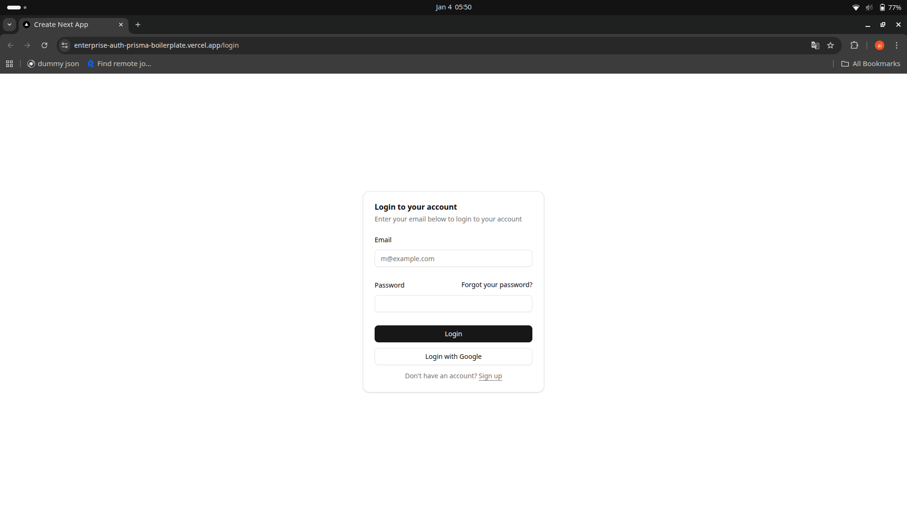
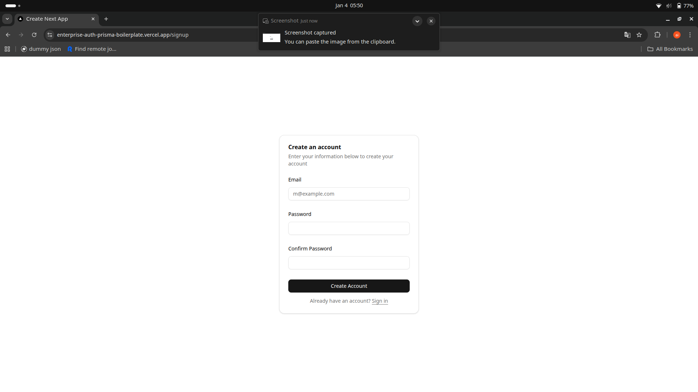
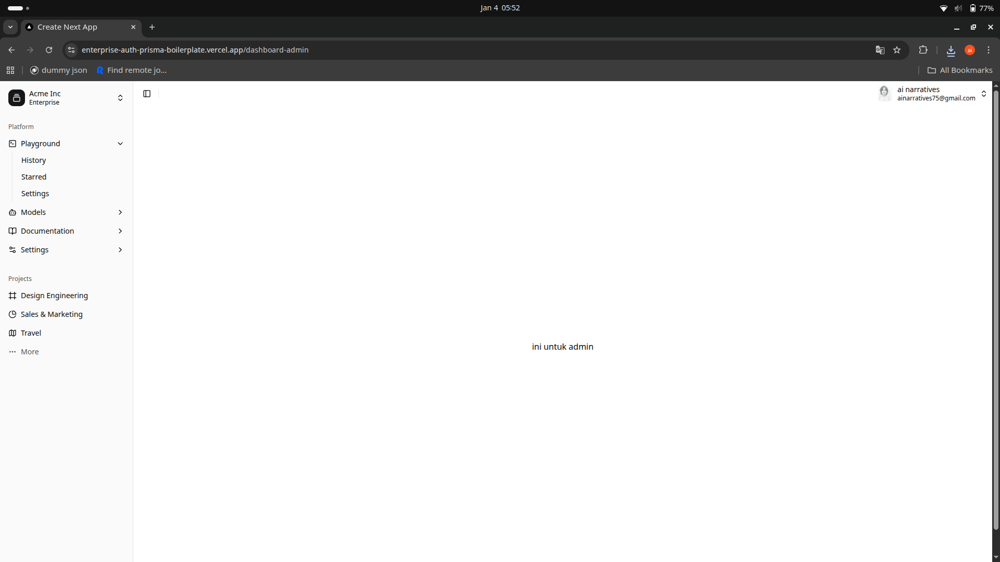
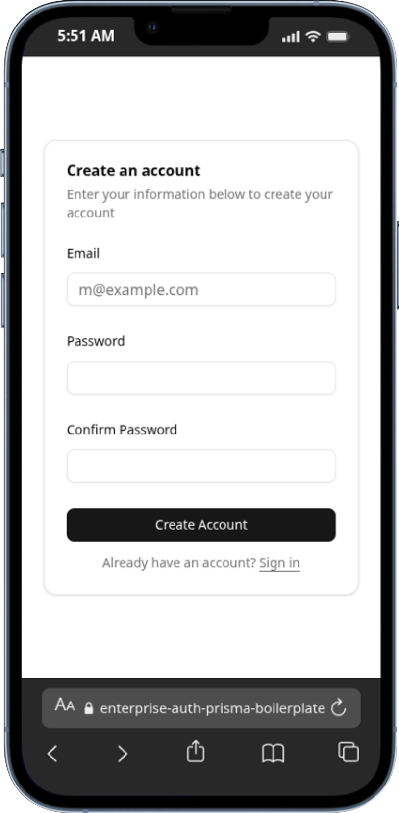
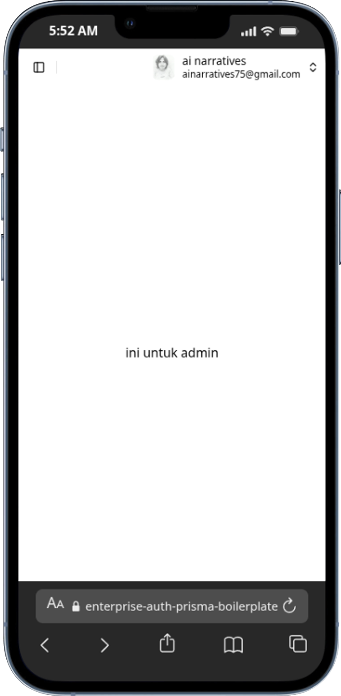

# 🛡️ Enterprise Auth Prisma Boilerplate

A **Production-ready** Next.js 15 Authentication system designed for security, scalability, and developer experience. This boilerplate implements a robust security layer featuring Auth.js v5, advanced Rate-Limiting, and Role-Based Access Control (RBAC).

**[Live Demo](https://enterprise-auth-prisma-boilerplate.vercel.app/)** | **[Author LinkedIn](https://www.linkedin.com/in/heri-hermansyah/)**

---

## 🚀 Key Features

- **Next.js 16 (App Router)**: Utilizing the latest React 19 features and Server Components.
- **Auth.js v5 (Beta)**: Modern, edge-compatible authentication (OAuth Google & Credentials).
- **RBAC (Role-Based Access Control)**: Secure authorization levels for users and admins.
- **Rate-Limiting**: Protection against Brute-Force and DDoS using **Upstash Redis**.
- **Database**: PostgreSQL with **Prisma ORM** and Supabase integration.
- **Security First**: Password hashing using `bcryptjs` and Zod-validated input.
- **Modern UI**: Built with **TailwindCSS 4**, Shadcn UI components, and Dark Mode support.

---

## 🛠️ Tech Stack & Library Deep-Dive

### **Core Framework**

- **Next.js 16 & React 19**: Utilizing the newest compiler for optimized performance.
- **TypeScript**: Ensuring type safety across the entire application.

### **Authentication & Security**

- **Auth.js v5**: Handles session management and OAuth providers seamlessly.
- **Bcryptjs**: Used for industrial-standard password hashing, ensuring that even if the database is compromised, user passwords remain secure.
- **Upstash Redis Rate-Limiting**: A global security layer that limits request rates per IP, preventing automated bot attacks on your login/sign-up endpoints.

### **Database & State**

- **Prisma ORM**: Type-safe database client for PostgreSQL.
- **Supabase**: Managed database infrastructure for production reliability.
- **Zod**: Schema-first validation for API requests and environment variables.

### **UI/UX Components**

- **TailwindCSS 4**: Leveraging the latest engine for ultra-fast styling.
- **Radix UI**: Accessible, unstyled primitives for UI components.
- **Sonner**: Clean and intuitive toast notifications.

---

## ⚙️ Getting Started

### 1. Prerequisites

- Node.js 20+
- PNPM (recommended)

### 2. Installation

```bash
git clone https://github.com/username/enterprise-auth-prisma-boilerplate.git
cd enterprise-auth-prisma-boilerplate
pnpm install

```

### 3. Environment Variables

Create a `.env` file in the root directory and fill in the following credentials:

```env
# Database (Supabase/PostgreSQL)
DATABASE_URL="your_postgresql_url"

# Authentication (Auth.js)
AUTH_SECRET="run_openssl_rand_-base64_32"
AUTH_TRUST_HOST=true

# Google OAuth
AUTH_GOOGLE_ID="your_google_client_id"
AUTH_GOOGLE_SECRET="your_google_client_secret"

# Supabase
NEXT_PUBLIC_SUPABASE_API_URL="your_supabase_url"
SUPABASE_API_SECRETE_KEY="your_supabase_key"

# Rate Limiting (Upstash Redis)
UPSTASH_REDIS_REST_URL="your_redis_url"
UPSTASH_REDIS_REST_TOKEN="your_redis_token"

```

### 4. Database Setup

```bash
npx prisma generate
npx prisma db push

```

### 5. Running the App

```bash
pnpm dev

```

---

## 🛡️ Security Implementation

This project implements a Middleware security layer that intercepts and inspects every request before it reaches the server. Sessions are validated in real-time, and a robust Rate-Limiter automatically throttles or blocks IP addresses making excessive requests within a short window (e.g., 10 requests per 10 seconds on the login route) to mitigate brute-force and DDoS attempts.

---

## 👤 Author

**Heri Hermansyah**

- LinkedIn: [@heri-hermansyah](https://www.linkedin.com/in/heri-hermansyah/)
- Location: Indonesia 🇮🇩

---

_Developed with ❤️ as a robust foundation for modern web applications._

---

## SCREENSHOTS







---

📜 License
This project is open-source under the MIT License.
